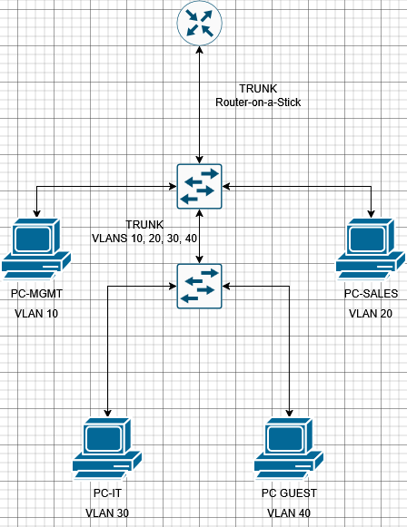

# Small Business Network Lab (EVE-NG)
---
## Documentation

Additional design details are available in the `docs/` directory.

## **Overview**

This project is a personal learning exercise focused on understanding how small business networks are structured and managed in practice. While studying networking concepts as part of my CCNA, I wanted to explore how these ideas come together in a more realistic setting. In this project, I have used a simulated environment to study how a simple office network can be organised, automated, and controlled using common networking principles introduced at the CCNA level.

---

## **Objectives**

The aim of this project is to:
* Explore how network segmentation is applied in practice
* Understand inter-VLAN communication in a structured setup
* Simulate automatic IP address assignment using DHCP
* Introduce basic access control between different parts of a network

---

## **Business Scenario**

A small business operating from a single office has grown to include multiple teams working on the same network.

Initially, all devices were connected without clear structure. As the business expanded, it became increasingly difficult to manage how devices were organised and how different parts of the network interacted.

This project explores how a simple redesign can introduce structure, improve organisation, and allow more controlled communication between departments.

---

## **Tools Used**

### **EVE-NG Community**
Network simulation environment. While exploring different lab environments, I also looked at [PNETLab](https://pnetlab.com/) as an alternative open-source platform. 

For this project, I chose to work with [EVE-NG Community](https://www.eve-ng.net/) as it provided a straightforward and stable environment for building and testing network topologies. This allowed me to focus on applying networking concepts such as VLANs, routing, and access control without being distracted by platform setup or behaviour. Other tools such as Cisco Packet Tracer, GNS3, and Cisco Modeling Labs (CML) were considered during the early stages of the project.

A virtualised EVE-NG environment was selected as it provided a good balance between realism and accessibility, allowing the network to be built and tested in a practical way without additional licensing requirements.

### **VMWare Worstation**
Used to host the EVE-NG lab environment. The EVE-NG Community lab environment is hosted within VMware Workstation, running on an Ubuntu 22.04 virtual machine. This layered setup allows network devices such as routers and switches to be emulated within a controlled environment, making it possible to build, modify, and test network configurations safely. It also mirrors how virtualised lab environments are commonly used to explore and validate network designs before deployment.

### **Cisco IOSv / Cisco IOSvL2**
Virtual routing and switching devices.

### **VPCS**
End-device simulation for testing.

### **MobaXterm Personal Edition**
Terminal access to devices.

### **draw.io**
Topology diagram creation.

### **Visual Studio Code**
Used to write and edit Markdown documentation.

### **GitHub**
Project documentation and version control.

---

## **High-Level Design**

The network is organised into separate logical groups representing different departments:

* Management
* Sales
* IT
* Guest

Each department is placed in its own VLAN to maintain separation, while a central router allows controlled communication between them.

Basic access control is introduced to limit unnecessary interaction between departments.

---

## **Low-Level Design Summary**

### VLAN & IP Scheme 

#### Design rationale

The addressing scheme was structured so that each VLAN corresponds to a matching subnet (e.g. VLAN 10 → 192.168.10.0/24). This approach keeps the network easy to read, troubleshoot, and manage, as device IP addresses can be quickly associated with their respective departments.

A /24 subnet was selected for each VLAN to keep the design simple while providing sufficient address space for a small business environment.

The use of private addressing (192.168.x.x) reflects common practice for internal networks and avoids unnecessary complexity at this stage of the design.

#### VLAN & IP Allocation

| VLAN | Department | Subnet          | Gateway      |
| ---- | ---------- | --------------- | ------------ |
| 10   | Management | 192.168.10.0/24 | 192.168.10.1 |
| 20   | Sales      | 192.168.20.0/24 | 192.168.20.1 |
| 30   | IT         | 192.168.30.0/24 | 192.168.30.1 |
| 40   | Guest      | 192.168.40.0/24 | 192.168.40.1 |

Further design details can be found in:

- [High-Level Design](docs/high-level-design.md)
- [Low-Level Design](docs/low-level-design.md)

---

## **Topology**

A visual representation of the network:

  

---

## **Implementation Approach**

The network is being built in stages to reflect a structured approach:

1. VLAN creation and device assignment
2. Trunk configuration between switches
3. Inter-VLAN routing (router-on-a-stick)
4. DHCP configuration
5. Access control using ACLs

---

## **Configurations**

Device configurations are stored in:

- [configs/](configs/)

---

## **Build Notes**

Additional notes for each stage of the build:

- [build-notes/](build-notes/)

---

## **Testing Summary**

The network will be tested to confirm:

* Devices receive IP addresses via DHCP
* Connectivity within and across VLANs
* Access restrictions behave as expected

Detailed validation results will be documented in the [tests/](tests/) directory.

---

## **Troubleshooting**

Issues encountered during the build and how they were resolved are documented in the [notes/](notes/) directory.

---

## **Reflection**

This project provides a practical way to explore how networking concepts translate into real-world scenarios.

Building the network step by step helps reinforce how structure, automation, and access control contribute to a more manageable environment.

---

## **Future Improvements**

Possible extensions to this project include:

* Adding a server VLAN
* Implementing NAT for external connectivity
* Introducing secure device management (SSH)
* Exploring redundancy and failover concepts

---
